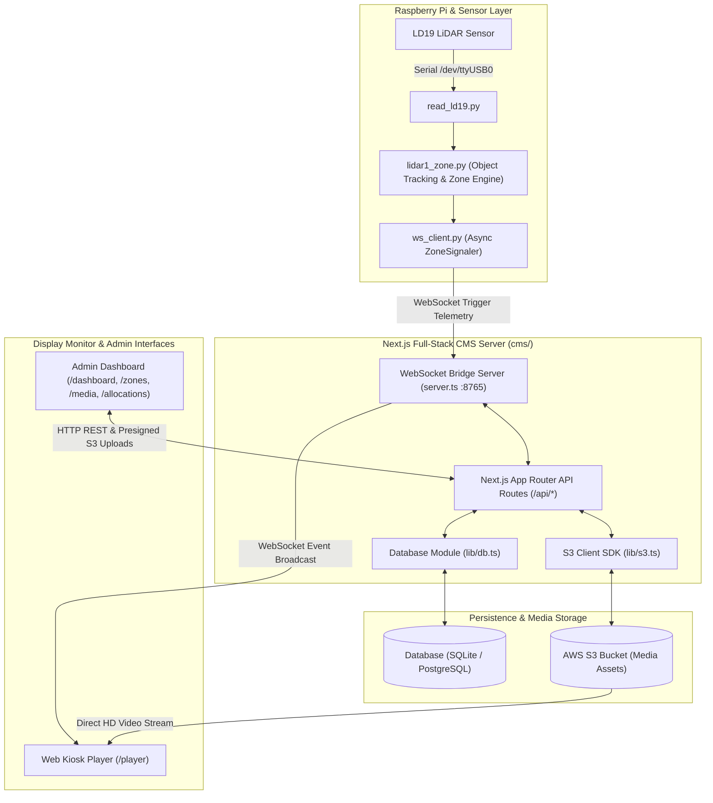
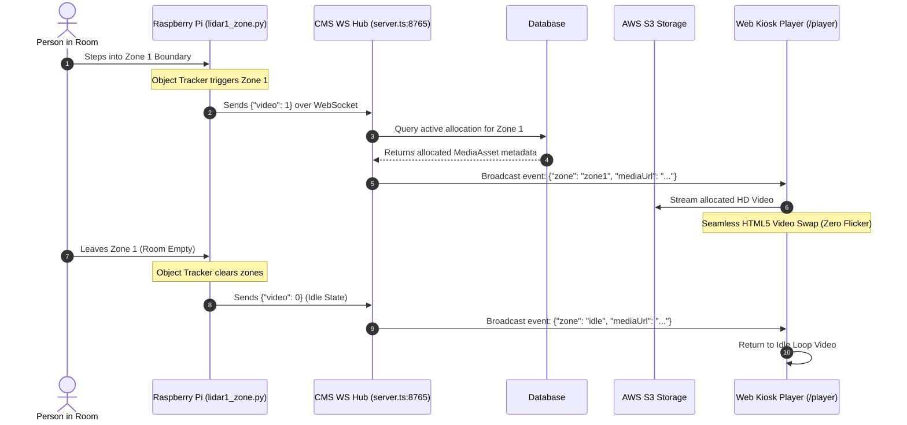
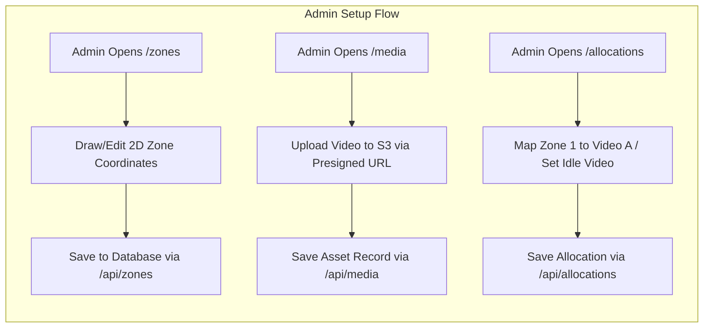

# LiDAR Zones Streaming CMS

This repository contains the software for a LiDAR-based interactive zone detection and video streaming content management system (CMS).

---

## Architecture Overview

The system is transitioning from a desktop script setup (`Laptopcodes/`) to a modern, full-stack web application (`cms/`):

1. **Raspberry Pi (LiDAR Client - `rasp pi codes/`)**:
   * Captures telemetry from an LD19 LiDAR sensor.
   * Tracks objects and monitors spatial boundaries in real time.
   * Sends WebSocket trigger events (`{"video": 1}`, `{"video": 2}`, `{"video": 0}`) to the CMS server.
   * Exposes debug video streams via Flask (port 8080).

2. **Next.js Full-Stack CMS (`cms/`) [Replacing `Laptopcodes/`]**:
   * **Real-Time WebSocket Hub**: Receives zone triggers from Raspberry Pi and broadcasts updates to connected Web Kiosk displays.
   * **Admin Management UI**: Interactive control panel for dynamic zone creation, S3 media management, and zone-to-content mapping.
   * **Web Kiosk Video Player (`/player`)**: Fullscreen web video display replacing the legacy VLC player. Features seamless HTML5 video transitions and pre-loading.
   * **Database & Storage**: Database layer (SQLite / PostgreSQL) and AWS S3 object storage for high-definition video assets.

3. **Legacy Laptop Server (`Laptopcodes/`) [Deprecated]**:
   * Legacy Python script (`pc_server.py`) running Tkinter + VLC player. Replaced by the web-based `/player` in Next.js CMS.

---

## Implementation Plan: Replacing `Laptopcodes` with `cms`

### Objectives
* Replace `Laptopcodes/pc_server.py` with the Next.js `cms` web player and server.
* Maintain 100% protocol compatibility with `rasp pi codes/ws_client.py`.
* Provide dynamic zone creation, AWS S3 upload/delete, dynamic zone-content allocation, and a web-based kiosk player.

### Tech Stack
* **Framework**: Next.js 15 (App Router, TypeScript, Tailwind CSS)
* **Database Layer**: Lightweight DB Layer (`lib/db.ts` - SQLite / PostgreSQL)
* **Object Storage**: AWS S3 Client SDK (`@aws-sdk/client-s3`) with Presigned URLs
* **Real-Time Communications**: Integrated Node.js WebSocket Server (`ws`) on port 8765

---

### System Diagrams

#### 1. End-to-End System Architecture



#### 2. Real-Time Zone Trigger Sequence



#### 3. Dynamic Management Flow



---

### Implementation Phases & Components

#### 1. Data Models & Database (`cms/lib/db.ts`)
* **`MediaAsset`**: Stores uploaded video metadata (`id`, `title`, `fileName`, `s3Key`, `publicUrl`, `mimeType`, `sizeBytes`, `duration`, `createdAt`).
* **`Zone`**: Stores spatial zone boundaries (`id`, `name`, `zoneKey`, `minX`, `maxX`, `minY`, `maxY`, `isActive`).
* **`ZoneAllocation`**: Maps zones to media assets (`id`, `zoneId`, `mediaId`, `isIdleDefault`, `priority`).
* **`DeviceConfig`**: Stores Raspberry Pi connection parameters and status.

#### 2. AWS S3 Integration (`cms/lib/s3.ts`)
* `POST /api/media/upload-url`: Generates secure S3 presigned URLs for direct browser-to-S3 uploads.
* `GET /api/media`: Retrieves list of media assets with public/presigned streaming URLs.
* `DELETE /api/media/[id]`: Deletes asset from database and purges S3 object.

#### 3. Real-Time WebSocket Server Bridge (`cms/server.ts`)
* Node.js server running alongside Next.js listening on WebSocket port `8765`.
* Accepts connections from `rasp pi codes/ws_client.py`.
* Ingests JSON messages (`{"video": 1}`, `{"video": 2}`, `{"video": 0}`) and relays events to `/player` and `/dashboard`.

#### 4. REST API Routes (`cms/app/api/`)
* `/api/zones`: CRUD endpoints for dynamic spatial zone creation and coordinate editing.
* `/api/media`: Endpoints for video metadata registration and listing.
* `/api/allocations`: Endpoints to assign uploaded media assets to specific zones or set as default idle video.

#### 5. User Interface (`cms/app/`)
* **Dashboard (`/dashboard`)**: System status, Pi connection indicator, real-time zone telemetry.
* **Zone Manager (`/zones`)**: Visual 2D coordinate grid editor to create and adjust spatial zones.
* **Media Library (`/media`)**: Drag-and-drop video uploader, preview player, file manager.
* **Allocations (`/allocations`)**: Interactive allocation matrix linking zones to videos.
* **Kiosk Video Player (`/player`)**: Fullscreen video display with preloaded HTML5 video elements for instant zero-flicker transitions.

---

## Setup and Quick Start

### Raspberry Pi Configuration
1. Install Python dependencies:
   ```bash
   pip install opencv-python flask pyserial websockets
   ```
2. Set the `PC_HOST` variable in `rasp pi codes/lidar1_zone.py` to your Next.js CMS host IP address.
3. Run the LiDAR tracker:
   ```bash
   python "rasp pi codes/lidar1_zone.py"
   ```

### Next.js CMS Quick Start (`cms/`)
1. Navigate to the `cms` directory:
   ```bash
   cd cms
   ```
2. Start the CMS development server:
   ```bash
   npm run dev
   ```
3. Open the Web Kiosk Player & CMS Dashboard:
   * **CMS Dashboard**: `http://localhost:3000`
   * **Web Kiosk Display**: `http://localhost:3000/player`


